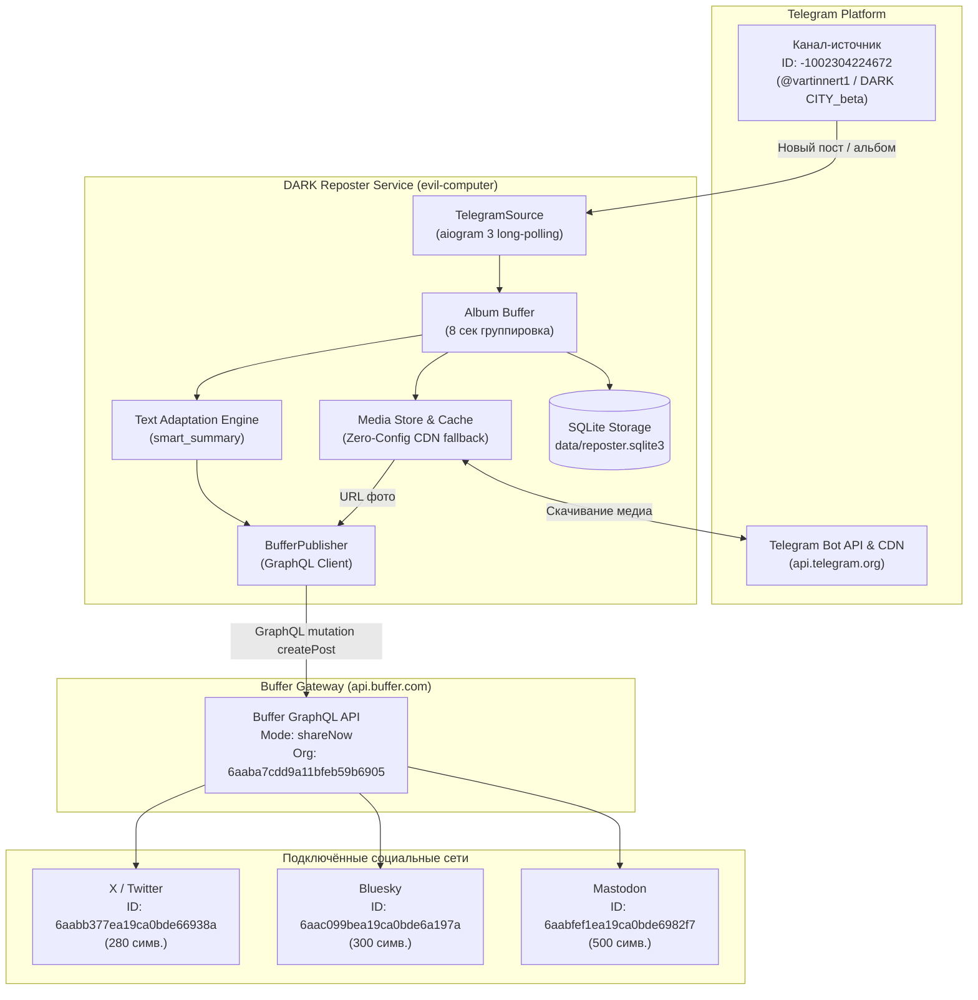

# DARK Reposter — Техническая спецификация и архитектура системы

Документ содержит детальное техническое описание принципа работы сервиса **DARK Reposter**, перечень подключаемых внешних ресурсов, потоков данных и статус подключённых социальных сетей.

---

## 1. Назначение системы

**DARK Reposter** — автономный сервис кросспостинга контента из Telegram-канала в социальные сети. Сервис отслеживает появление новых сообщений (включая текстовые посты и медиагруппы/альбомы с фотографиями), адаптирует текст под индивидуальные ограничения каждой платформы без потери смысла и публикует их через API Buffer.



---

## 2. Потоки данных и архитектурные компоненты

### 2.1. Приём сообщений (`src/dark_reposter/telegram_app.py`)
- **Протокол**: aiogram 3 Long-Polling (`allowed_updates=["channel_post", "edited_channel_post", "message"]`).
- **Канал-источник**: проверяется соответствие `chat.id == TELEGRAM_CHANNEL_ID` (`-1002304224672`). Посты из сторонних каналов игнорируются.
- **Обработка альбомов (медиагрупп)**: посты с несколькими фото приходят в Telegram как отдельные апдейты с общим `media_group_id`. `TelegramSource` буферизует их в течение `MEDIA_GROUP_WAIT_SECONDS=8`, упорядочивает по `message_id` и объединяет медиафайлы в единый пост.
- **Извлечение скрытых ссылок**: функция `first_text()` сканирует сущности `text_link` и добавляет их целевые URL в конец текста, сохраняя ссылки, спрятанные в разметке Telegram.
- **Интерактивный статус-бот**: при отправке любого сообщения или команд `/start`, `/help`, `/status`, `/info` боту `@dark_reposter_bot` в личные сообщения формируется подробная карточка текущего состояния системы и активных соцсетей.

### 2.2. Защита от дублей и хранилище (`src/dark_reposter/storage.py`)
- **База данных**: SQLite по пути `data/reposter.sqlite3`.
- **Таблицы**:
  - `telegram_posts` (`id`, `chat_id`, `message_ids`, `text`, `media_count`, `created_at`).
  - `publications` (`id`, `post_id`, `platform`, `status`, `remote_id`, `adapted_text`, `media_urls`, `error`, `created_at`).
- **Дедупликация**: метод `is_already_processed(chat_id, message_ids)` проверяет связку канала и ID сообщений перед любой обработкой, исключая повторные публикации при перезапуске бота.

### 2.3. Интеллектуальная адаптация текста (`src/dark_reposter/text_adapt.py`)
- **Контекстное сжатие (`smart_summary`)**:
  - Текст делится на логические параграфы и полные предложения.
  - Если исходный пост укладывается в лимит символов платформы — он отправляется целиком без искажений.
  - Если пост превышает лимит — алгоритм отбирает полные абзацы и ключевые предложения, не допуская обрезки слов на полуслове ("огрызков") и не вырывая отдельные несвязные фразы.
  - Приоритет отдаётся смысловому тексту, ссылкам и финальным хештегам.
- **Санитизация URL**: регулярные выражения предотвращают образование висячих круглых скобок `(` и квадратных скобок `]` при обработке ссылок вида `(https://...)`.
- **Маршрутизация по тегам**:
  - `#x`, `#bsky`, `#masto`, `#threads`, `#in` — публикация только в выбранные соцсети.
  - `#draft` — пост адаптируется и сохраняется в БД со статусом `draft`, но **не** отправляется в Buffer.
  - `#noauto` — пост полностью пропускается.

### 2.4. Обработка медиафайлов (`src/dark_reposter/media.py`)
- **Zero-Config Telegram CDN**: если в `.env` не настроен локальный HTTP-сервер со статическим белым IP (`PUBLIC_MEDIA_BASE_URL`), сервис формирует прямой публичный URL к файлу на серверах Telegram (`https://api.telegram.org/file/bot<TOKEN>/<FILE_PATH>`).
- **Буфер Buffer API**: Buffer самостоятельно скачивает изображение по этому URL в момент создания публикации.
- **Ротация дискового кэша**: метод `cleanup_old_media()` хранит на диске только 50 последних файлов, защищая хранилище от переполнения.

### 2.5. Публикация контента (`src/dark_reposter/publishers/buffer.py`)
- **Протокол**: HTTP POST к GraphQL API Buffer.
- **Мутация**: `mutation CreatePost($input: CreatePostInput!)`.
- **Режим**: `mode = "shareNow"` (мгновенная публикация) со `schedulingType: "automatic"`.
- **Пакетная обработка**: адаптация и вызов API производятся отдельно для каждой целевой платформы с учётом её индивидуальных лимитов символов и медиафайлов.

---

## 3. Подключаемые внешние ресурсы

| Ресурс | Адрес / Endpoint | Протокол / Аутентификация | Назначение |
| :--- | :--- | :--- | :--- |
| **Telegram Bot API** | `https://api.telegram.org` | HTTPS / Bot Token (`8708985657:...`) | Получение постов из канала, отправка служебных сообщений, загрузка файлов |
| **Telegram File CDN** | `https://api.telegram.org/file/bot...` | HTTPS / Публичный доступ по токену | Прямая передача ссылок на медиафайлы в Buffer |
| **Buffer GraphQL API** | `https://api.buffer.com` | HTTPS / Bearer Token (`1/38ec8b...`) | Создание публикаций в соцсетях (`Org: 6aaba7cdd9a11bfeb59b6905`) |
| **Локальная SQLite БД** | `/mnt/gasworks.bsp/.../data/reposter.sqlite3` | Локальный I/O (sqlite3) | Хранение истории публикаций, аудит, дедупликация, черновики |

---

## 4. Статус задействованных социальных сетей

На текущий момент в конфигурации `.env` активированы **3 социальные сети**:

| Социальная сеть | Статус | Buffer Channel ID | Лимит текста | Лимит медиа | Примечания |
| :--- | :---: | :--- | :---: | :---: | :--- |
| **X (Twitter)** | 🟢 **АКТИВЕН** | `6aabb377ea19ca0bde66938a` | **280** симв. | 4 фото | Основной микроблог, жёсткий лимит текста |
| **Bluesky** | 🟢 **АКТИВЕН** | `6aac099bea19ca0bde6a197a` | **300** симв. | 4 фото | Децентрализованная сеть AT Protocol |
| **Mastodon** | 🟢 **АКТИВЕН** | `6aabfef1ea19ca0bde6982f7` | **500** симв. | 4 фото | Fediverse-микроблог, расширенный лимит текста |
| **Threads** | ⚪ *Не активен* | *(не задан в .env)* | 500 симв. | 4 фото | Поддерживается кодом; для включения достаточно указать ID канала |
| **LinkedIn** | ⚪ *Не активен* | *(не задан в .env)* | 3000 симв. | 9 фото | Поддерживается кодом; для включения достаточно указать ID канала |

---

## 5. Управление сервисом на сервере

Сервер: `evil-computer` (`192.168.31.220`), пользователь `dark`.  
Директория: `/home/dark/dark-reposter` -> `/mnt/gasworks.bsp/Telegram online24/DARK Reposter`.

### Основные команды
- **Статус сервиса**:
  ```bash
  systemctl --user status dark-reposter.service
  ```
- **Перезапуск**:
  ```bash
  systemctl --user restart dark-reposter.service
  ```
- **Просмотр логов в реальном времени**:
  ```bash
  journalctl --user -u dark-reposter.service -f
  ```
- **Запуск тестов**:
  ```bash
  cd /home/dark/dark-reposter && PYTHONPATH=src .venv/bin/python -m unittest discover tests
  ```
